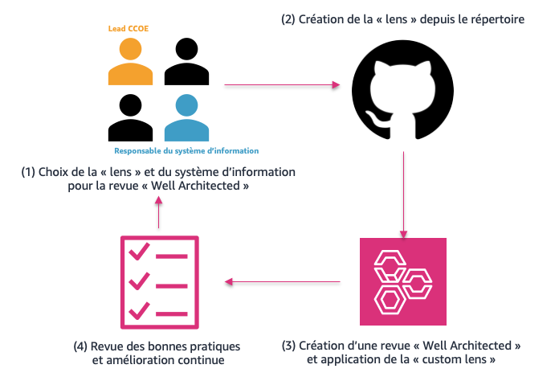

# AWS Well-Architected : Public Sector Custom Lenses

:fr: Ce répertoire, initialement maintenu par les équipes du secteur public français, propose des cadres d'opération et de conception des applications visant à répondre aux enjeux spécifiques du secteur public. Ces cadres reposent sur un outil rapide permettant d'automatiser la création de "custom lenses" pour l'outil <a href="https://aws.amazon.com/fr/well-architected-tool/">AWS Well-Architected Tool</a>.

Destiné aux directeurs des technologies et aux architectes d'entreprise, il vient compléter notre répertoire sur <a href="https://github.com/aws-samples/audit-manager-custom-security-frameworks">la gouvernance à l'échelle des environnements AWS</a> en offrant des outils supplémentaires pour orienter l'utilisation des services et la conception des architectures.


:gb: This repository, initially maintained by teams from the French public sector, offers operational and application design frameworks aimed at addressing the specific challenges of the public sector. These frameworks are built upon a small tool that automates the creation of "custom lenses" for the <a href="https://aws.amazon.com/fr/well-architected-tool/">AWS Well-Architected Tool</a>.

Intended for Chief Technology Officers and Enterprise Architects, it complements our repository on <a href="https://github.com/aws-samples/audit-manager-custom-security-frameworks">governance at scale of AWS environments</a> by providing additional tools to guide the use of services and the design of architectures.

## Travailler avec des "Custom Lens"



## Custom Lenses disponibles

- :fr: Réversibilité des environnements ([Réversibilité](./data/reversibilite/README.MD))

## Principes d'architecture

La solution proposée est structurée autour des dossiers et fichiers :
- ***/model*** : Le dossier contient les formats de données à utiliser pour construire les piliers et les questions de la "custom lens". 

Ces modèles peuvent ensuite être rapidement utilisés afin de construire l'architecture de fichiers permettant de créer un cadre d'évaluation personnalisé pour le Well Architected tool.

- ***/data*** : Le dossier contient contient les fichiers sources permettant de constuire les "custom lens".

Afin d'être correctement parsé par l'outil fourni, la structure suivante doit être respectée.

## Avant le déploiement

- (>=v20.2.0) Disposer d'une version de node.js compatible avec le projet.
- Disposer de clefs de sécurité AWS (AK/SK) disposant des permissions (IAM Policy) nécessaires pour intéragir avec Well-Architected Tool.

Le déploiement est possible depuis un environnement local mais aussi depuis AWS Cloudshell qui est directement disponible depuis la console AWS.
- Cloner le répertoire ```git clone https://github.com/aws-samples/ps-wafr-custom-lenses.git```
- Aller dans le répertoire ```cd ps-wafr-custom-lenses```
- Installer les dépendances requises : ```npm install```

## Utilisation

1. Création d'un cadre d'évaluation personnalisé : ```node create_lens -r <aws-region> -f <framework>```

Ex : ```node create_lens -r eu-west-3 -f reversibilite``` déploit le référentiel associé à la réversibilité des environnements sur la region eu-west-3 (Paris.)

Le cadre d'évaluation personnalisé est maintenant disponible dans l'outil AWS Well-Architected Tool. Vous pouvez maintenant définir vos charges de travail à évaluer et sélectionner le cadre personnalisé dans l'étape 3 'Appliquer des lentilles'.

Note : 
- L'option ```-f <framework>``` est "case sensitive".
-  Le fichier ```reversibilite-custom-lens.json``` correspond au fichier de la custom lens résultant de l'aggrégation des fichiers sources. Il peut aussi être utilisé de manière indépendante à l'outil dans le cadre d'un appel API à l'outil Well-Architected effectué via la cli/sdk/console d'AWS.
- Le fichier ```reversibilite-lens-data.json``` correspond à l'identifiant (ARN) de la custom lens provisionnée à des fins de suppression.

2. Suppression d'un cadre d'évaluation personnalisé : ```node delete_lens -r <aws-region> -f <file>```

Ex : ```node delete_lens -f ./out/reversibilite-lens-data.json -r eu-west-3``` supprime la custom lens associée à la réversibilité des environnements.

## Création d'une "Custom Lens"

Afin de créer un cadre d'évaluation personnalisé :

1. Depuis le dossier ***/data*** créer un dossier < custom > qui servira de racine pour la création de la "custom lens".

    a. A la racine de ce dossier créer un fichier ```header.json``` et remplir les champs.

    b. (optional) Créer un fichier ```README.MD``` afin de documenter le cadre d'évaluation personnalisé créé.

2. Pour chaque pillier de la "custom lens", un dossier doit être créée. La nomenclature du nom du pillier respecte ```<Numérotation>_<abréviation>```.

    a. A la racine du dossier du pillier, un fichier de type ```pillar.json``` doit être ajouté. Le nom de ce fichier doit correspondre à la nomemclature ```<abréviation>.json```.

    b. Pour chaque question du pillier, créer un dossier correspondant au nom ```<abréviation>-questions```.

3. Les questions des piliers sont ajoutées en plaçant des fichiers de type ```question.json``` dans le dossier prévu.

## Notes

NA

## Security

See [CONTRIBUTING](CONTRIBUTING.md) for more information.

## License

This library is licensed under the MIT-0 License. See the [LICENSE](LICENSE) file.
