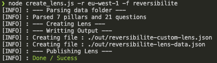
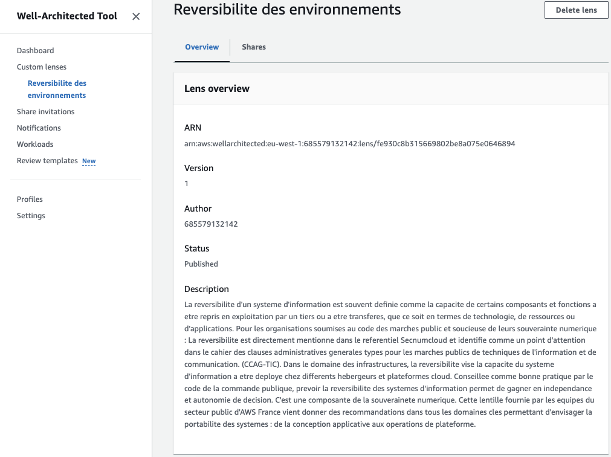
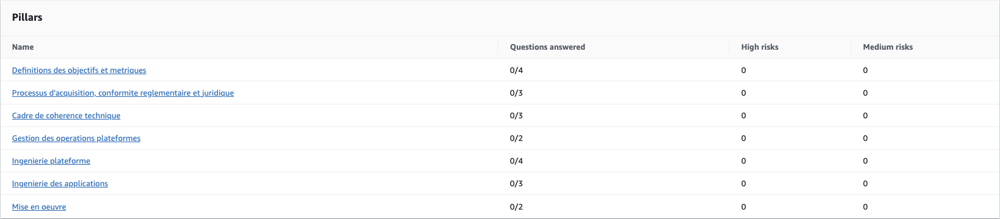
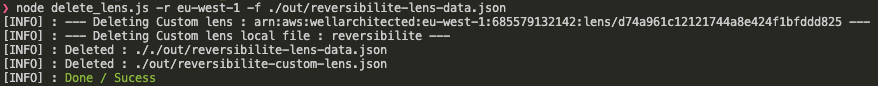

# Réversibilité des environnements
Le répertoire actuel propose des ressources pour élaborer un cadre d'évaluation destiné à l'outil <a href="https://docs.aws.amazon.com/wellarchitected/latest/userguide/intro.html">AWS Well-Architected</a> abordant les questions liées à la réversibilité des environnements sur AWS. En fournissant des meilleures pratiques et des recommandations, ce cadre permet de d'améliorer la reprise d'activité, réduire la dépendance à une solution (aussi appelée "vendor lock-in"), et préparer une éventuelle migration, tout en préservant la continuité des opérations.

En suivant la lens proposée, vous identifierez l'ensemble des mesures techniques et opérationnelles permettant de réduire dépendances et adhérences à une ou plusieurs plateformes cloud.

## A propos des problématiques de réversibilité
La réversibilité d'un système d'information est fréquemment définie comme la capacité de certains composants et fonctions à être repris en exploitation par un tiers ou à être transférés, que ce soit en termes de technologie, de ressources ou d'applications.

Le Cigref identifie les enjeux de souveraineté dans son référentiel <a href="https://www.cigref.fr/le-cigref-publie-son-referentiel-du-cloud-de-confiance">"Cloud de confiance"</a> en y dédiant 69 exigences réparties selon les châpitres : (1) Exigences procédurales (2) Exigences de portabilité (3) Exigences de périmètre et de portabilité (4) Exigences de planification (5) Conditions de transparence (6) Portabilité (7) Convention de services (8) Exportation des données (9) Importation des données.

Pour les organisations soumises au code des marchés publics, et soucieuses de leur souveraineté numérique, la réversibilité est directement mentionnée dans le référentiel SecNumcloud. D'autre part, cette dernière est un point d'attention dans le cahier des clauses administratives générales types pour les marchés publics de techniques de l'information et de communication (CCAG-TIC).

Dans le CCAG-TIC, l'<a href="https://www.legifrance.gouv.fr/jorf/article_jo/JORFARTI000043310752">article 38.4 de l'arrêté du 30 mars 2021</a> introduit la notion de réversibilité dans le chapitre 6 : "Maintenance, tierce maintenance applicative et infogérance". Il est important de noter que la définition des prestations et des critères à inclure et à respecter est laissée à l'appréciation des acheteurs.

Les exigences 19.h et 19.i énoncées dans le chapitre 19 "Exigences supplémentaires" du référentiel <a href="https://www.ssi.gouv.fr/uploads/2014/12/secnumcloud-referentiel-exigences-v3.2.pdf">Secnumcloud</a> permettent d'apporter une première caractérisation technique des propriétés de réversibilité d'une plateforme cloud. En particulier :

>19.h : Le prestataire doit inclure dans la convention de service une clause de réversibilité permettant au commanditaire de récupérer l’ensemble de ses données (fournies directement par le commanditaire ou produites dans le cadre du service à partir des données ou des actions du commanditaire).

et 

>19.i : Le prestataire doit assurer cette réversibilité via l’une des modalités techniques suivantes : 
>- la mise à disposition de fichiers suivant un ou plusieurs formats documentés et exploitables en dehors du service fourni par le prestataire ;
>- la mise en place d’interfaces techniques permettant l’accès aux données suivant un schéma documenté et exploitable (API, format pivot, etc.).

Bien que cela ne soit pas obligatoire et ne dispose pas d'un référentiel dédié, la pertinence de la réversibilité des systèmes d'information se comprend en intégrant la périodicité des procédures de marchés publics, qui favorisent la concurrence pour les prestations, les réalisations et les déploiements.

Ainsi, travailler sur la réversibilité des systèmes d'information permet (1) de gagner en autonomie de décision, (2) de favoriser l’innovation et la performance via l’appel à la concurrence dans le cadre des marchés publics, et (3) de réduire les coûts et les délais associés à l'activation du plan de réversibilité.

## AWS une plateforme ouverte
AWS respecte déjà les principes de propriété, de localisation et de réversibilité des données. AWS offre à ses clients un contrôle total, une propriété incontestable et la portabilité de leurs données métier, leur permettant de changer de fournisseur s'ils le souhaitent. AWS propose de nombreuses solutions basées sur des solutions open source, ainsi que de la documentation et des bonnes pratiques d’architecture pour faciliter la mobilité des systèmes et des données.

En pratique, il est techniquement possible de transférer ou répliquer les données depuis le cloud AWS. Tous les services d'importation ou de synchronisation peuvent également être utilisés pour exporter des données. Le transfert des données peut se faire soit directement par Internet, soit par un réseau privé ou via des équipements physiques. Les formats de données restent entièrement sous le contrôle des clients AWS. De plus, les clauses contractuelles AWS précisent explicitement que le client peut récupérer ses données à tout moment (<a href="https://d1.awsstatic.com/legal/aws-customer-agreement/AWS_Customer_Agreement_French_2023-01-20.pdf">voir AWS Customer Agreement</a>).

En particulier, les transferts et les mobilités peuvent être déclenchés en utilisant les interfaces programmables disponibles (API), en interagissant directement avec les services de base de données (connexions directes) ou via l'interface graphique (console) mise à disposition.

Sur AWS, nos clients ont le choix et le contrôle.

## Travailler la réversibilité de son système d'information
Travailler sur la réversibilité de ses systèmes d'information, que ce soit en termes de mobilité ou de reprise d'exploitation, implique les domaines suivants (dont certains sont couverts dans le cadre de la "lens") :

1. Identification du périmètre
2. Définition des objectifs
3. Cadre d'achat des plateformes et alternatives
4. Conception des cadres techniques de référence et gouvernance du cloud    
5. Harmonisation des fonctions et des outils d'administration
6. Automatisation et standardisation des plateformes
7. Révision des principes d'ingénierie des applications
8. Vérification des objectifs
9. Gestion des compétences des opérateurs

En fonction des objectifs affichés, il pourrait être intéressant de prendre en considération l'utilisation d'une plateforme de type "cloud hybride" ainsi que les principes et les étapes décrits dans le <a href="https://docs.aws.amazon.com/whitepapers/latest/disaster-recovery-workloads-on-aws/disaster-recovery-options-in-the-cloud.html">AWS Disaster Recovery Whitepaper</a>.

## Travailler avec AWS Well-Architected Tool
L'utilisation d'AWS Well-Architected Tool permet de disposer d'un méchanisme permettant l'évaluation d'un sous-ensemble du système d'information.

Après la création d'une "custom lens", celle-ci peut être appliquée à une "workload".

## Conduire une Well Architected Review
Nous invitons les clients d'AWS à se rapprocher de leurs équipes de compte afin de bénéficier de l'accompagnement d'un Solution Architect pour guider et soutenir une revue Well-Architected de réversibilité.

## Liens de référence
- Direction des achats de l'état (DAE), Guide de l'achat public : https://www.economie.gouv.fr/files/files/directions_services/dae/doc/Guide_PII_web.pdf 
- Legifrance, cahier des clauses administratives générales des marchés publics de techniques de l'information et de la communication (CCAG-TIC) https://www.legifrance.gouv.fr/jorf/id/JORFTEXT000043310689
- Cabinet Bismuth - Bismuth.fr, fiche_pratique_commerce_electronique, https://www.bismuth.fr/_media/fr:actualites:fiche_pratique_commerce_electronique.pdf
- ANSSI, Référentiel Secnumcloud, https://www.ssi.gouv.fr/uploads/2014/12/secnumcloud-referentiel-exigences-v3.2.pdf
- Cigref, Référentiel "Trusted Cloud" : https://www.calameo.com/cigref/read/00586923533d0b3b24296
- AWS, Travailler le lock-in : https://docs.aws.amazon.com/whitepapers/latest/unpicking-vendor-lock-in/unpick-vendor-lock-in.html
- AWS Well-Architected Tool : https://docs.aws.amazon.com/wellarchitected/latest/userguide/intro.html
- AWS Customer Agreement : https://d1.awsstatic.com/legal/aws-customer-agreement/AWS_Customer_Agreement_French_2023-01-20.pdf
- AWS Disaster recovery : https://docs.aws.amazon.com/whitepapers/latest/disaster-recovery-workloads-on-aws/disaster-recovery-options-in-the-cloud.html

## Captures d'écran / Screenshot

